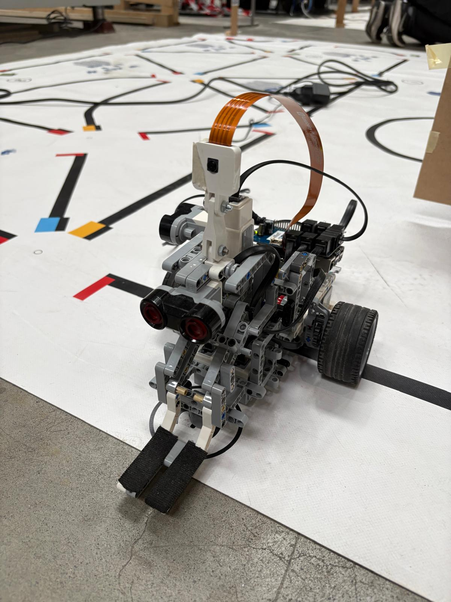
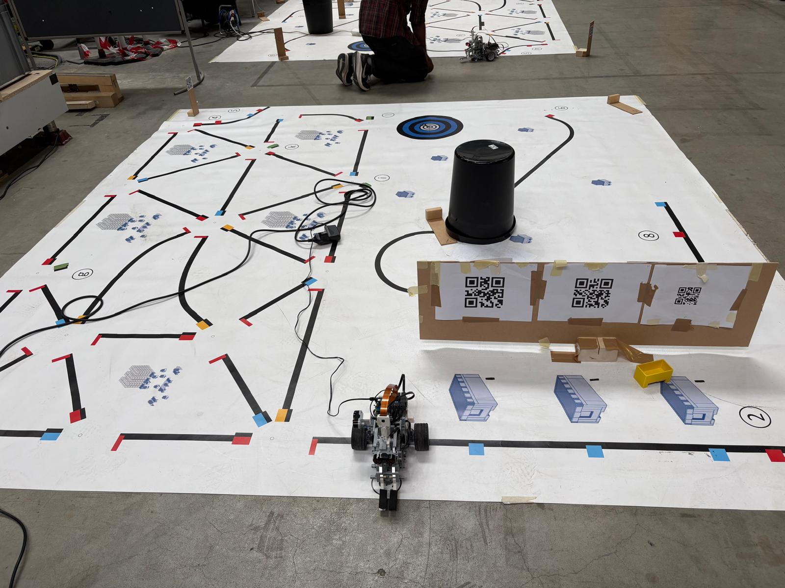

## Mobile Robot Intralogistics Challenge

This project demonstrates the implementation of an automated intralogistics process using a mobile robot. 
The goal was to simulate a real-world warehouse workflow and validate the feasibility of replacing manual transport systems with an 
Autonomous Guided Vehicle (AGV).

## Overview

We developed and programmed a mobile robot to complete a full logistics cycle, starting from goods receipt to final delivery and return 
to the charging station. The system integrates line-following, QR code recognition, obstacle avoidance, and MQTT communication.

## Robot 

## Map 

## Implemented Tasks

### 1. Start at Factory Entrance
The robot waits at a traffic light and proceeds only when the signal turns green.

### 2. Container Pickup (Goods Receipt)
- QR code scanning for task identification  
- Verification of the correct container using matching QR codes  

### 3. Storage Process
- Navigation to predefined storage locations  
- Shortest path calculation using Dijkstra’s Algorithm for efficient routing inside the warehouse  
- Delivery and exit from storage area  

### 4. Worker Interaction (MQTT)
- Robot sends arrival signal  
- Receives packaging information from worker via MQTT
- The packaging type (shape) is selected and transmitted to the robot  
- This information is stored and used in later stages of the process  

### 5. Worker Following
- Robot follows a worker using QR code tracking    

### 6. Obstacle Avoidance
- Stops for 10 seconds when obstacle detected  
- Performs bypass maneuver if obstacle remains  

### 7. Packaging Identification (Computer Vision)
- The robot uses the previously received packaging type (from MQTT)  
- Applies image processing techniques to identify the correct station  
- Matches the detected station with the required packaging shape  
- Delivers the container to the correct station autonomously   

### 8. Return to Charging Station
- Navigation without line-following  

## Technologies Used

- Python
- Dijkstra’s Algorithm (path planning)
- Computer Vision (image processing for station detection)
- Line-following algorithms  
- QR Code detection  
- MQTT communication  
- Autonomous navigation & obstacle avoidance  

## Result

The robot successfully completed the full intralogistics workflow, demonstrating that mobile robots can effectively automate internal 
logistics processes in warehouse environments.
